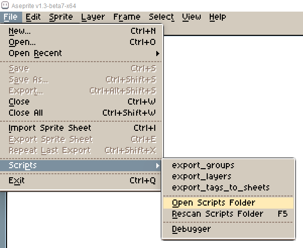

# Aseprite-GO

[](https://goreportcard.com/report/github.com/andygeiss/aseprite-go)

**Supercharge your Aseprite Workflow with custom scripts and a Go module**

Adam shared some bits and pieces that he uses all the time in Aseprite to speed up his workflow on [YouTube](https://www.youtube.com/watch?v=hiMBVCFMj6E).

He and others provided custom scripts which could be used to split a single spritesheet into multiple files by using the tags.

**With this Go module you can automatically extract the generated spritesheets and use it in your Go project.** 

## Install the scripts

Copy the .lua files from the [plugins](https://github.com/andygeiss/aseprite-go/tree/main/plugins) folder to your Aspeprite scripts folder and use the Rescan (F5) function. 



## Open example project

Open the [sprites](https://github.com/andygeiss/aseprite-go/tree/main/sprites) folder with Aseprite and open the `player.aseprite` file. 

This spritesheet contains an idle and walk animation facing the up, down, left and right direction.


Now use the script menu in Aseprite to execute `export_tags_to_sheets` which creates a corresponding .json and .png file for each tag.

## Read the spritesheets with Go

```golang

func main() {
    path := filepath.Join("sprites")
    sprites, _ := aseprite.LoadSpritesheet(path)

    frames := sprites["player-idle-down"] // get access to the frames of the animation
    
    duration := frames[0].DurationMs // get the duration in milliseconds
    pos_x := frames[0].Pos_X // get x and y position in the spritesheet
    pos_y := frames[0].Pos_Y
    png := filepath.Join("sprites", "player-idle-down.png") // spritesheet is always key + .png
}

```

Now everytime you change something in Aseprite the spritesheets could be immediatly used after using the export scripts!
